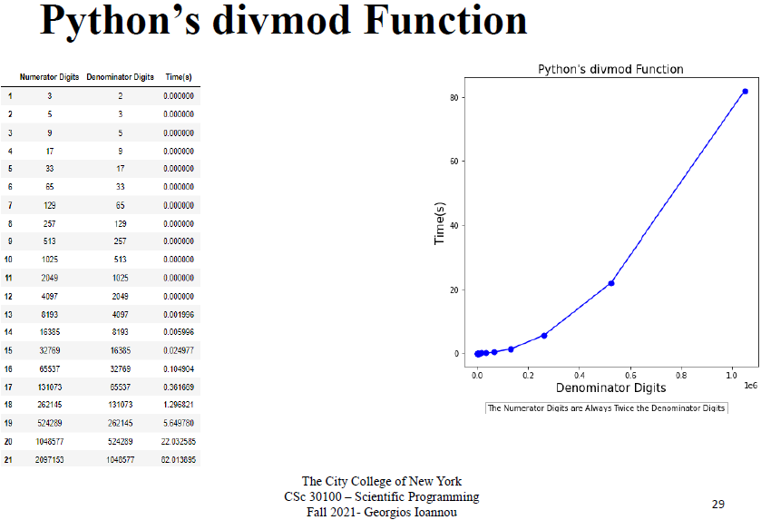
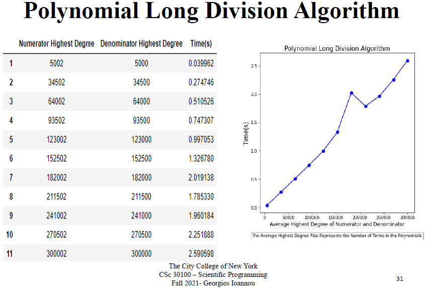

# Revolutionizing the Division Operation | Analysis and Implementation of Common Division Algorithms
<a name="readme-top"></a>

[![Contributors][contributors-shield]][contributors-url]
[![Forks][forks-shield]][forks-url]
[![Stargazers][stars-shield]][stars-url]
[![Issues][issues-shield]][issues-url]
[![MIT License][license-shield]][license-url]
[![LinkedIn][linkedin-shield]][linkedin-url]
[![GitHub][github-shield]][github-url]

<br />
<div align="center">
  

<h3 align="center"><a href="https://github.com/GeorgiosIoannouCoder/division-algorithms/blob/main/report/Ioannou_Georgios_Report.pdf">Analysis and Implementation of Common Division Algorithms</a></h3>

  <p align="center">
    Division is the most time-consuming, resource expensive, and complex arithmetic operation. Hardware and software support for floating-point arithmetic is a must in modern central processor units. Even though division is used the least compared to addition and multiplication, it is becoming increasingly important in modern complex applications. The performance of such applications is affected and limited by the algorithms used for division. This project and <a href="https://github.com/GeorgiosIoannouCoder/division-algorithms/blob/main/report/Ioannou_Georgios_Report.pdf">Report</a> study some of the most used division algorithms such as <b>long division, restoring, non-restoring, SRT, Newton-Raphson, Goldschmidt, accurate quotient approximations, polynomial long division, and polynomial extended synthetic division</b>. <b>The <a href="https://github.com/GeorgiosIoannouCoder/division-algorithms/blob/main/report/Ioannou_Georgios_Report.pdf">Report</a> continues by comparing the fastest division algorithm with Python’s built-in integer division, divmod function, and polydiv function</b>. Finally, the <a href="https://github.com/GeorgiosIoannouCoder/division-algorithms/blob/main/report/Ioannou_Georgios_Report.pdf">Report</a> concludes that the <b>Newton-Raphson division algorithm is the fastest for integers, and the polynomial extended synthetic division algorithm is the fastest for polynomials.</b> Moreover, the <a href="https://github.com/GeorgiosIoannouCoder/division-algorithms/blob/main/report/Ioannou_Georgios_Report.pdf">Report</a> illustrates that <b>Newton-Raphson division algorithm and polynomial extended synthetic division algorithm are faster and more efficient than Python’s built-in algorithms</b>.
    <br />
    <a href="https://github.com/GeorgiosIoannouCoder/division-algorithms"><strong>Explore the docs »</strong></a>
    <br />
    <br />
    <a href="https://github.com/GeorgiosIoannouCoder/division-algorithms/issues">Report Bug</a>
    ·
    <a href="https://github.com/GeorgiosIoannouCoder/division-algorithms/issues">Request Feature</a>
  </p>
</div>

<details>
  <summary>Table of Contents</summary>
  <ol>
    <li>
      <a href="#about-the-project">About The Project</a>
      <ul>
        <li><a href="#division-algorithms-for-this-project">Division Algorithms For This Project</a></li>
        <li><a href="#key-feature">Key Feature</a></li>
        <li><a href="#built-with">Built With</a></li>
      </ul>
    </li>
    <li>
      <a href="#getting-started">Getting Started</a>
      <ul>
        <li><a href="#prerequisites">Prerequisites</a></li>
        <li><a href="#setup">Setup</a></li>
      </ul>
    </li>
    <li><a href="#code">Code</a></li>
    <li><a href="#report">Report</a></li>
    <li><a href="#slides">Slides</a></li>
    <li><a href="#analysis-and-conclusions">Analysis and Conclusions</a></li>
    <li><a href="#contributing">Contributing</a></li>
    <li><a href="#license">License</a></li>
    <li><a href="#contact">Contact</a></li>
  </ol>
</details>

## About The Project


### Division Algorithms For This Project

Division Alogirthms can be categorized into:
**1. Division of unsigned integers**
**2. Division of polynomials**


<p align="right"><a href="#readme-top">Back to top</a></p>


### Key Feature

1. **Excessively test each Division Algorithm with the number of digits starting from 0 and going up to 2,097,153.**
2. **Excessively test each Polynomial Division Algorithm with the degree of the polynomial starting from 5,000 and going up to 300,002.**

<p align="right"><a href="#readme-top">Back to top</a></p>

### Built With

[![Python][Python]][Python-url]
[![JupyterNotebook][JupyterNotebook]][JupyterNotebook-url]
[![Anaconda][Anaconda]][Anaconda-url]
[![Pandas][Pandas]][Pandas-url]
[![Matplotlib][Matplotlib]][Matplotlib-url]
[![Git][Git]][Git-url]

<p align="right"><a href="#readme-top">Back to top</a></p>

## Getting Started

**To get a local copy of the Revolutionizing the Division Operation project up and running locally follow these simple example steps:**

### Prerequisites

**NOTE:** How to check if Python is installed and what is its version

```sh
  python --version
```

**NOTE:** How to check if Git is installed and what is its version

```sh
  git -v
```

1. Please make sure you have pyenv installed and use Python3 version 3.11.0:

   - You can use pyenv to switch between different Python versions:
     - Windows: [https://www.youtube.com/watch?v=HTx18uyyHw8](https://github.com/pyenv-win/pyenv-win)
     - Mac: [https://www.youtube.com/watch?v=31WU0Dhw4sk](https://github.com/pyenv/pyenv)
     - Linux: [https://www.youtube.com/watch?v=1Zgo8M9yUtM](https://github.com/pyenv/pyenv)

2. Please make sure you have git installed

   - Windows: [https://git-scm.com/download/win](https://git-scm.com/download/win)
   - Mac: [https://git-scm.com/download/mac](https://git-scm.com/download/mac)
   - Linux: [https://git-scm.com/download/linux](https://git-scm.com/download/linux)

3. Please look at the [setup](https://github.com/GeorgiosIoannouCoder/tessa/tree/main/setup) folder found in this project to find the directions specific to your operating system. The general instructions can also be found below.

### Setup

1. Navigate to the directory where you want to clone/run/save the application:

   ```sh
   cd your_selected_directory
   ```

2. Clone this repository:

   ```sh
   git clone https://github.com/GeorgiosIoannouCoder/division-algorithms.git
   ```

3. Navigate to the realesrgan git repository:

   ```sh
   cd division-algorithms
   ```

4. Use Python3 3.11.0 version in the cloned repository folder:

   ```sh
   pyenv local 3.11.0
   ```

5. Create virtual environment in the cloned repository folder:

   ```sh
   python -m venv .division-algorithms-venv
   ```

6. Activate the virtual environment (Windows OR Mac/Linux):

   1. Windows

   ```sh
   .\.division-algorithms-venv\Scripts\activate
   ```

   2. Mac/Linux

   ```sh
   source .division-algorithms-venv/bin/activate
   ```

7. Install the dependencies listed in the requirements.txt file:

   ```sh
   pip install -r requirements.txt
   ```

8. Install ipykernel:

   ```sh
   pip install ipykernel
   ```

9. Install Jupyter Notebook:

   ```sh
   pip install jupyter notebook
   ```

10. Add the kernel of the virtual environment in the Jupyter Notebook:

    ```sh
    ipython kernel install --user --name=.division-algorithms-venv
    ```

11. Run the Jupyter Notebook:

    ```sh
    jupyter notebook
    ```

12. Select the .division-algorithms-venv kernel to run the Jupyter Notebook.

13. To Run The [Notebook](https://github.com/GeorgiosIoannouCoder/division-algorithms/blob/main/code/Ioannou_Georgios_Code.ipynb) (4 Options):
       1. Steps above and also [here]()
       2. Use [Google Colaboratory](https://colab.research.google.com/)
       3. Use [Jupyter Notebboks Extension for VS Code](https://code.visualstudio.com/docs/datascience/jupyter-notebooks)
       4. Use [Anaconda](https://www.anaconda.com/)
          1. Download and install [Anaconda](https://www.anaconda.com/download)
          2. Launch a jupyter notebook:
              1. MacOS users, open up terminal and type in `jupyter notebook`
              2. Window users, open up your Anaconda Power Shell, and type in `jupyter notebook`

<p align="right"><a href="#readme-top">Back to top</a></p>

## Code

The full project code with the output can be found [here](https://github.com/GeorgiosIoannouCoder/division-algorithms/blob/main/code/Ioannou_Georgios_Code.ipynb).

<p align="right"><a href="#readme-top">Back to top</a></p>

## Report

The report of this project with a comprehensive exaplanation of all the Division Algorithms is located [here](https://github.com/GeorgiosIoannouCoder/division-algorithms/blob/main/report/Ioannou_Georgios_Report.pdf). The figures found inside the Report are located [here](https://github.com/GeorgiosIoannouCoder/division-algorithms/tree/main/Figures) and [here](https://github.com/GeorgiosIoannouCoder/division-algorithms/blob/main/report/Ioannou_Georgios_Appendix.pdf).

## Slides

The slides of this project are located [here](https://github.com/GeorgiosIoannouCoder/division-algorithms/blob/main/slides/Ioannou_Georgios_Slides.pdf).

<p align="right"><a href="#readme-top">Back to top</a></p>

## Analysis and Conclusions

- Number of atoms in the universe = 10^78 to 10^82
- Newton Raphson division algorithm = 2,097,153 digits (able to carry the most complex tasks)
- Polynomial extended synthetic division algorithm = 300,002 nd degree polynomials
- Newton Raphson division algorithm is the fastest and faster than Python’s built in functions
- None of the division algorithms is considered as the best
- There is a trade off in choosing what division algorithm to use and it depends on the task needed to be done

From this [Report](https://github.com/GeorgiosIoannouCoder/division-algorithms/blob/main/report/Ioannou_Georgios_Report.pdf) and based on Table A5 and Graph A5, we concluded that the **fastest division algorithm for large-scale complex tasks is the Newton Raphson division algorithm.** However, it is also expected that the Goldschmidt division algorithm and the accurate quotient approximations division algorithm will also be fast. T**he Newton Raphson division algorithm is so fast that the Python programming language may want to override its integer division algorithm with this algorithm.** For smaller scale and simpler tasks, the long division algorithm can also be used.

**For polynomial division it is better to implement the polynomial extended synthetic division algorithm rather than the polynomial long division algorithm because it is faster, simpler, and uses fewer resources.** The Python programming language may also consider in overriding its polydiv function with the polynomial extended synthetic division algorithm because it solves the issue of memory.

Below are the Figures found inside the [Appendix](https://github.com/GeorgiosIoannouCoder/division-algorithms/blob/main/report/Ioannou_Georgios_Appendix.pdf) and [Slides](https://github.com/GeorgiosIoannouCoder/division-algorithms/blob/main/slides/Ioannou_Georgios_Slides.pdf).

## UNSIGNED INTEGERS





## POLYNOMIALS




<p align="right"><a href="#readme-top">Back to top</a></p>

## Contributing

Contributions are what make the open source community such an amazing place to learn, inspire, and create. Any contributions you make are **greatly appreciated**.

If you have a suggestion that would make this better, please fork the repo and create a pull request. You can also simply open an issue with the tag "enhancement".
Don't forget to give the project a star! Thanks again!

1. Fork the Project
2. Create your Feature Branch (`git checkout -b feature/AmazingFeature`)
3. Commit your Changes (`git commit -m 'Add some AmazingFeature'`)
4. Push to the Branch (`git push origin feature/AmazingFeature`)
5. Open a Pull Request

<p align="right"><a href="#readme-top">Back to top</a></p>

## License

Distributed under the MIT License. See [LICENSE](https://github.com/GeorgiosIoannouCoder/division-algorithms/blob/master/LICENSE) for more information.

MIT License

Copyright (c) 2021 Georgios Ioannou

Permission is hereby granted, free of charge, to any person obtaining a copy
of this software and associated documentation files (the "Software"), to deal
in the Software without restriction, including without limitation the rights
to use, copy, modify, merge, publish, distribute, sublicense, and/or sell
copies of the Software, and to permit persons to whom the Software is
furnished to do so, subject to the following conditions:

The above copyright notice and this permission notice shall be included in all
copies or substantial portions of the Software.

THE SOFTWARE IS PROVIDED "AS IS", WITHOUT WARRANTY OF ANY KIND, EXPRESS OR
IMPLIED, INCLUDING BUT NOT LIMITED TO THE WARRANTIES OF MERCHANTABILITY,
FITNESS FOR A PARTICULAR PURPOSE AND NONINFRINGEMENT. IN NO EVENT SHALL THE
AUTHORS OR COPYRIGHT HOLDERS BE LIABLE FOR ANY CLAIM, DAMAGES OR OTHER
LIABILITY, WHETHER IN AN ACTION OF CONTRACT, TORT OR OTHERWISE, ARISING FROM,
OUT OF OR IN CONNECTION WITH THE SOFTWARE OR THE USE OR OTHER DEALINGS IN THE
SOFTWARE.

<p align="right"><a href="#readme-top">Back to top</a></p>

## Contact

Georgios Ioannou - [@LinkedIn](https://linkedin.com/in/georgiosioannoucoder)

Georgios Ioannou - [@georgiosioannoucoder](https://georgiosioannoucoder.github.io/) - Please contact me via the form in my portfolio.

Project Link: [https://github.com/GeorgiosIoannouCoder/division-algorithms](https://github.com/GeorgiosIoannouCoder/division-algorithms)

<p align="right"><a href="#readme-top">Back to top</a></p>

[contributors-shield]: https://img.shields.io/github/contributors/GeorgiosIoannouCoder/division-algorithms.svg?style=for-the-badge
[contributors-url]: https://github.com/GeorgiosIoannouCoder/division-algorithms/graphs/contributors

[forks-shield]: https://img.shields.io/github/forks/GeorgiosIoannouCoder/division-algorithms.svg?style=for-the-badge
[forks-url]: https://github.com/GeorgiosIoannouCoder/division-algorithms/network/members

[stars-shield]: https://img.shields.io/github/stars/GeorgiosIoannouCoder/division-algorithms.svg?style=for-the-badge
[stars-url]: https://github.com/GeorgiosIoannouCoder/division-algorithms/stargazers

[issues-shield]: https://img.shields.io/github/issues/GeorgiosIoannouCoder/division-algorithms.svg?style=for-the-badge
[issues-url]: https://github.com/GeorgiosIoannouCoder/division-algorithms/issues

[license-shield]: https://img.shields.io/github/license/GeorgiosIoannouCoder/division-algorithms.svg?style=for-the-badge
[license-url]: https://github.com/GeorgiosIoannouCoder/division-algorithms/blob/master/LICENSE

[linkedin-shield]: https://img.shields.io/badge/-LinkedIn-black.svg?style=for-the-badge&logo=linkedin&colorB=0077B5
[linkedin-url]: https://linkedin.com/in/georgiosioannoucoder

[github-shield]: https://img.shields.io/badge/-GitHub-black.svg?style=for-the-badge&logo=github&colorB=000
[github-url]: https://github.com/GeorgiosIoannouCoder/

[Python]: https://img.shields.io/badge/python-FFDE57?style=for-the-badge&logo=python&logoColor=4584B6
[Python-url]: https://www.python.org/

[JupyterNotebook]: https://img.shields.io/badge/jupyter%20notebook-808080?style=for-the-badge&logo=jupyter&logoColor=
[JupyterNotebook-url]: https://jupyter.org/

[Anaconda]: https://img.shields.io/badge/anaconda-000000?style=for-the-badge&logo=anaconda&logoColor=3eb049
[Anaconda-url]: https://www.anaconda.com/

[Pandas]: https://img.shields.io/badge/pandas-150458?style=for-the-badge&logo=pandas&logoColor=white
[Pandas-url]: https://pandas.pydata.org/

[Matplotlib]: https://img.shields.io/badge/matplotlib-3761a3?style=for-the-badge&logo=matplotlib&logoColor=white
[Matplotlib-url]: https://matplotlib.org/

[Git]: https://img.shields.io/badge/git-000000?style=for-the-badge&logo=git&logoColor=orange
[Git-url]: https://git-scm.com/
